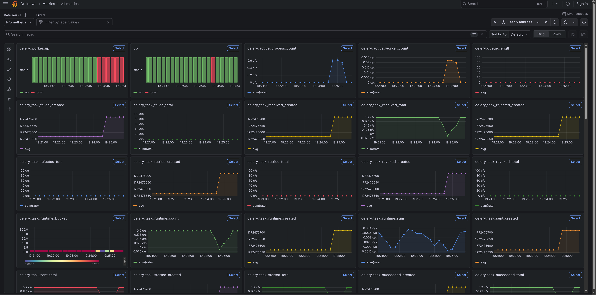
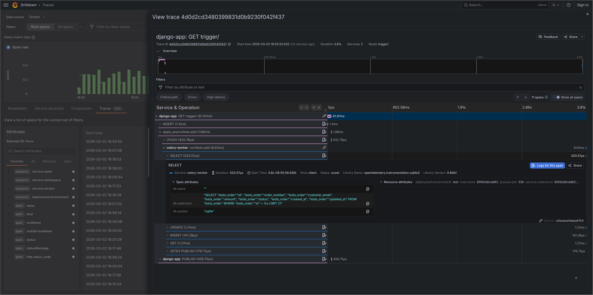
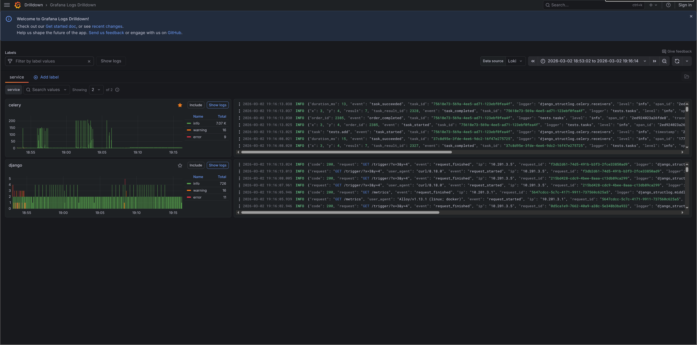
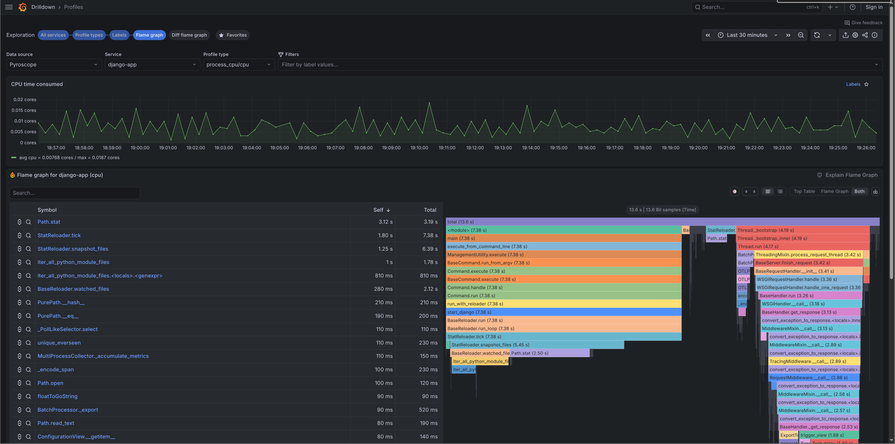
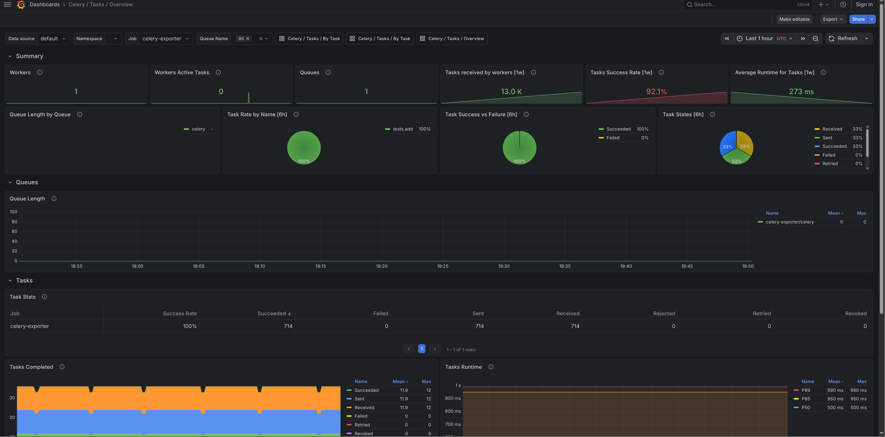
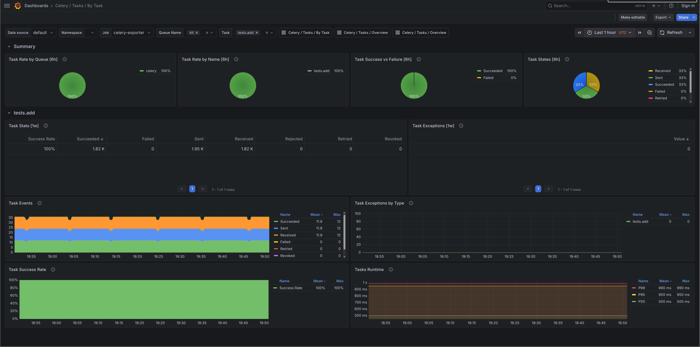
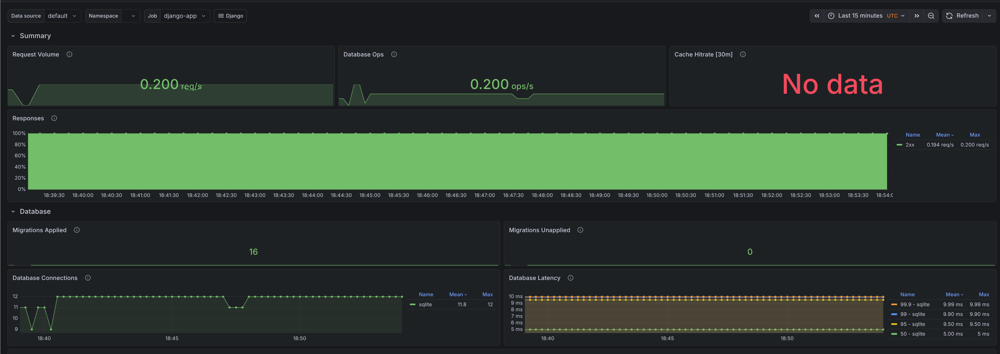
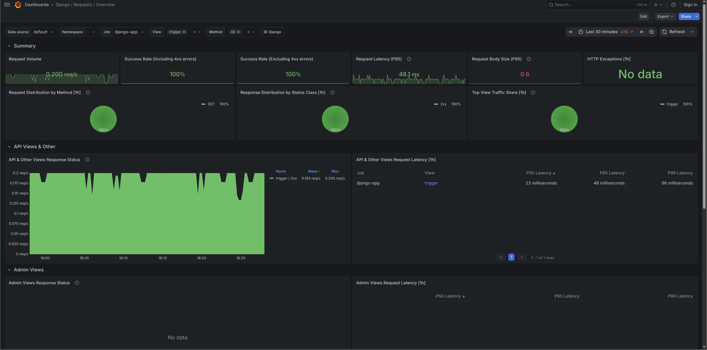
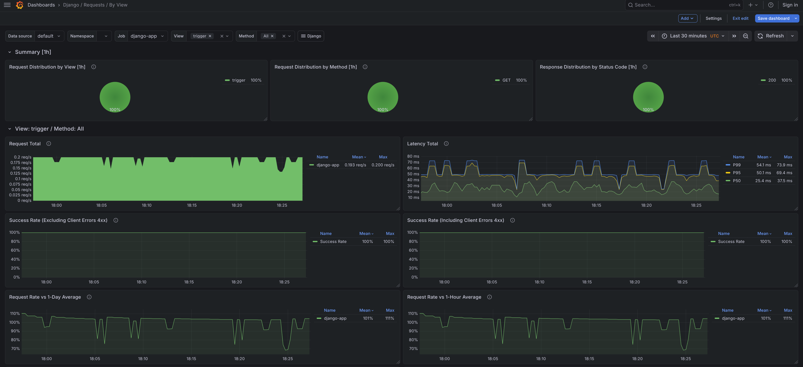
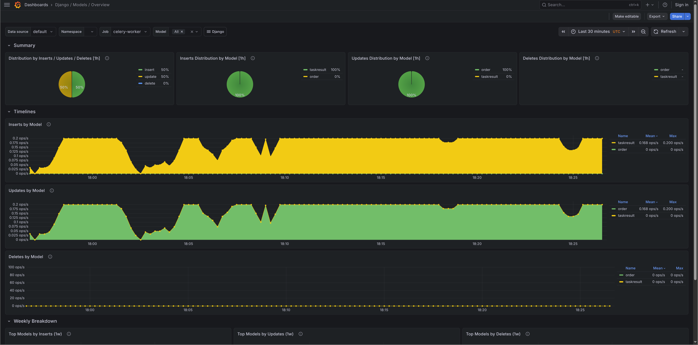

# Demo stack

Screenshots from `manage.py o11y stack start` running against the test project, a minimal Django app that fires one Celery task every 5 seconds via a `/trigger/` endpoint. Traffic is low so most panels are sparse, but everything is wired up.

Run it yourself with:

```bash
python manage.py o11y stack start
```

Grafana starts at `http://localhost:3000` with all dashboards pre-loaded and no login required.

## Metrics

Django request rates, latency percentiles, database query counts, cache hit rates, and migration status from [django-prometheus](https://github.com/korfuri/django-prometheus). Dashboards imported from [django-mixin](https://github.com/adinhodovic/django-mixin).



## Traces

Distributed traces from [OpenTelemetry](https://opentelemetry.io/) via [Tempo](https://grafana.com/oss/tempo/). Each HTTP request and Celery task gets a span, with database queries and outbound HTTP calls as child spans.



## Logs

Structured JSON logs from [structlog](https://www.structlog.org/) ingested via [Alloy](https://grafana.com/oss/alloy/) into [Loki](https://grafana.com/oss/loki/). Every log line carries `trace_id` and `span_id`, so you can jump from a log entry directly to its trace.



## Profiles

Continuous CPU profiling from [Pyroscope](https://pyroscope.io/). Flame graphs show where your app spends time. Profiles carry the same `service.name` and `deployment.environment` tags as your traces.



## Imported dashboards

These dashboards are pulled from Grafana.com when you run `o11y stack start`. They come from [django-mixin](https://github.com/adinhodovic/django-mixin) and [celery-mixin](https://github.com/danihodovic/celery-exporter/tree/master/celery-mixin). If a panel is wrong or a dashboard is missing something, open an issue in the relevant mixin repo rather than here.

### Celery / Tasks / Overview

Task throughput, failure rates, and queue depth across all workers.

- Grafana.com: [17509](https://grafana.com/grafana/dashboards/17509-celery-tasks-overview/)



### Celery / Tasks / By Task

Per-task execution time, success/failure counts, and retry rates.

- Grafana.com: [17508](https://grafana.com/grafana/dashboards/17508-celery-tasks-by-task/)



### Django / Overview

Request rate, error rate, p50/p95/p99 latency, and database query volume.

- Grafana.com: [17617](https://grafana.com/grafana/dashboards/17617-django-overview/)



### Django / Requests / Overview

Request metrics broken down by status code and method.

- Grafana.com: [17616](https://grafana.com/grafana/dashboards/17616-django-requests-overview/)



### Django / Requests / By View

Per-view latency and error rates. Good for finding which endpoints are slow or failing.

- Grafana.com: [17613](https://grafana.com/grafana/dashboards/17613-django-requests-by-view/)



### Django / Models / Overview

Insert, update, and delete counts per model. Shows which models background tasks are writing to most.

- Grafana.com: [24933](https://grafana.com/grafana/dashboards/24933-django-models-overview/)


